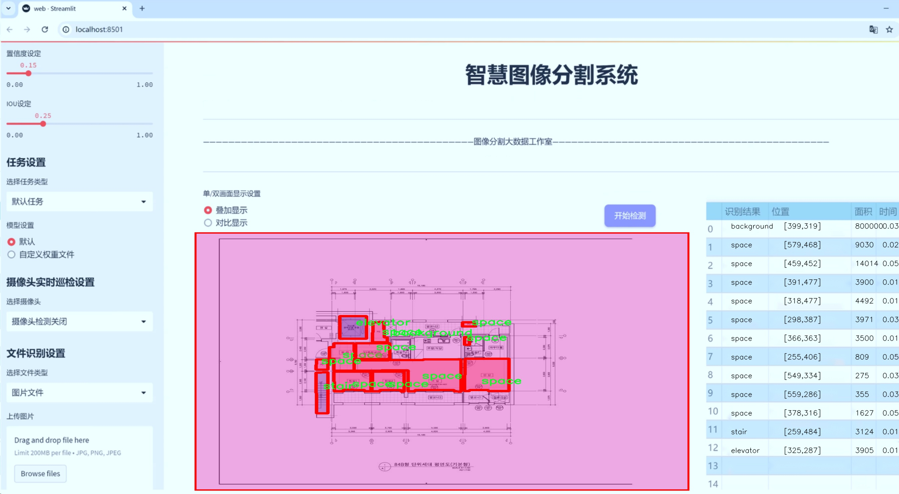
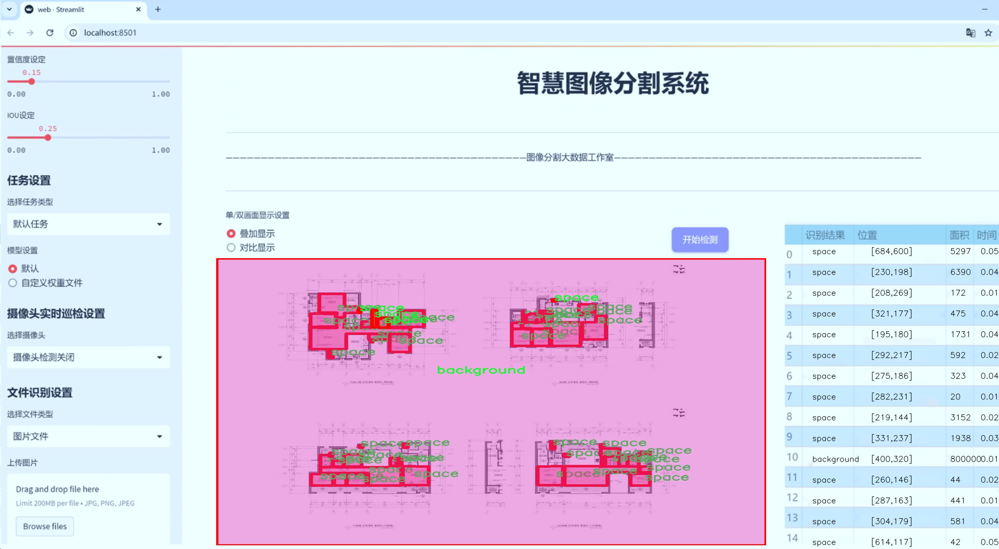
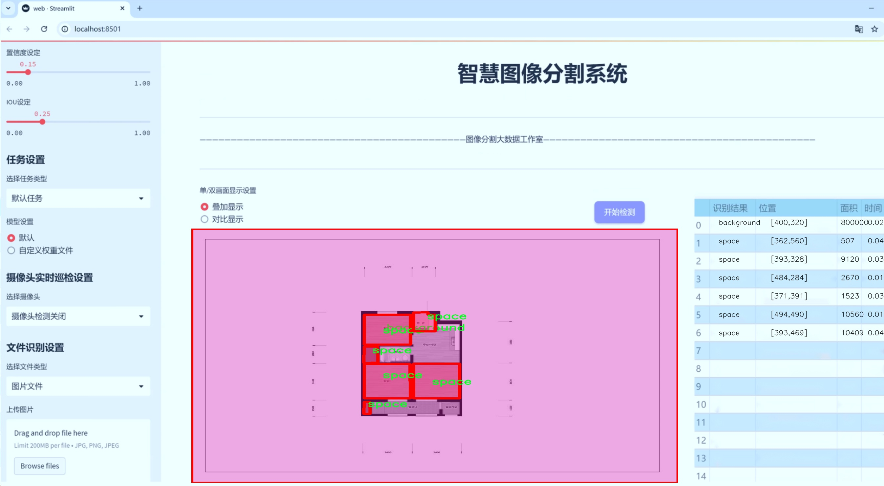
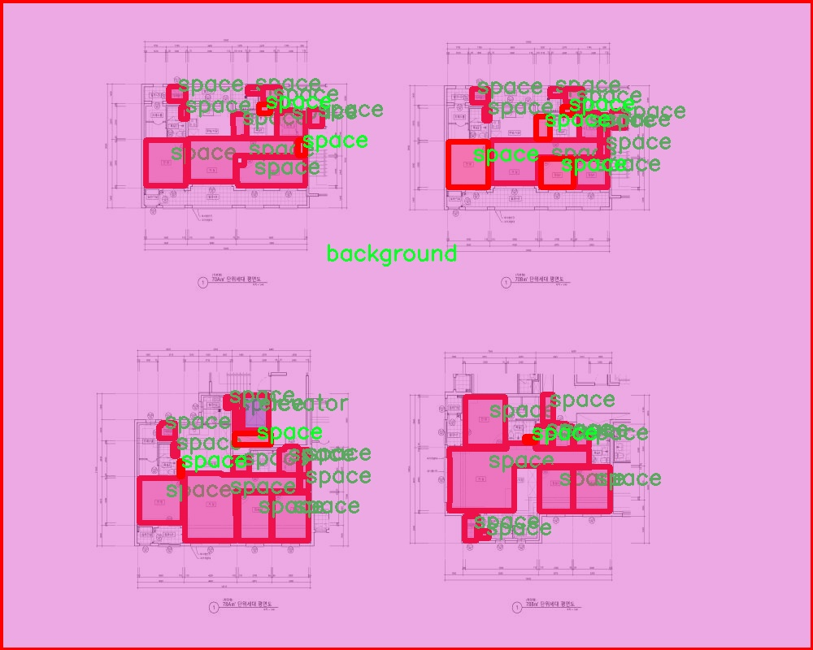
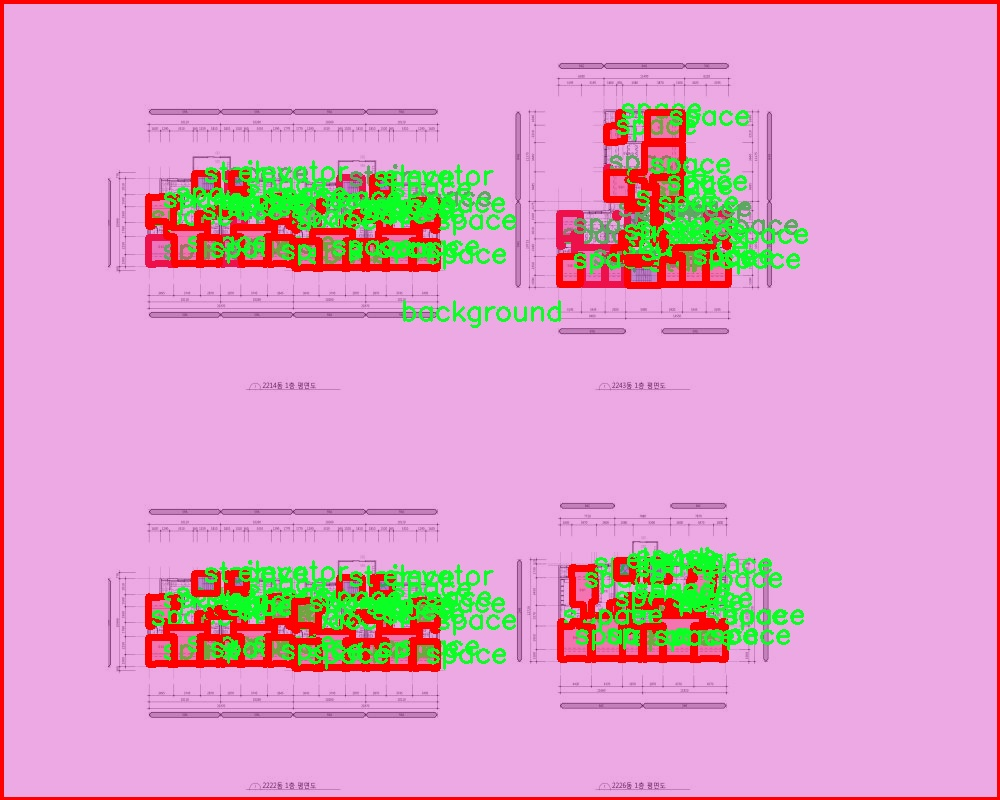
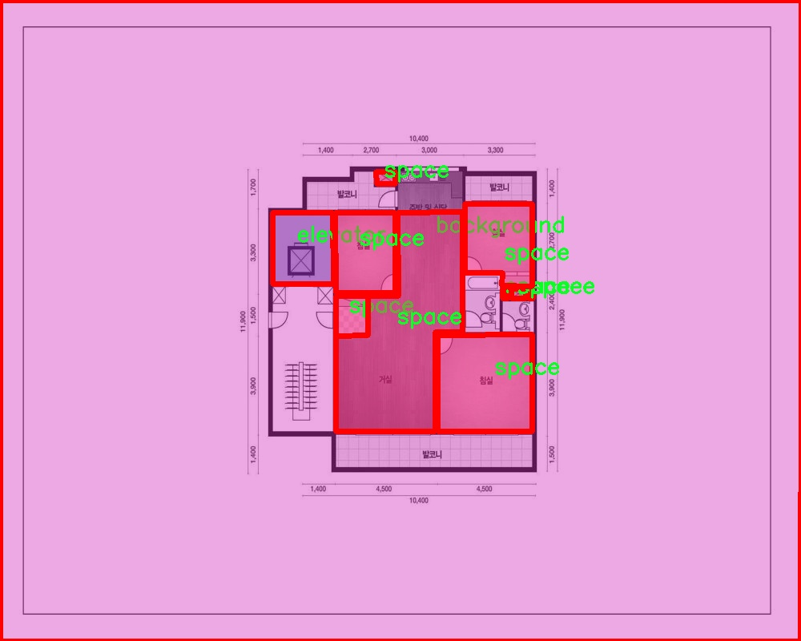
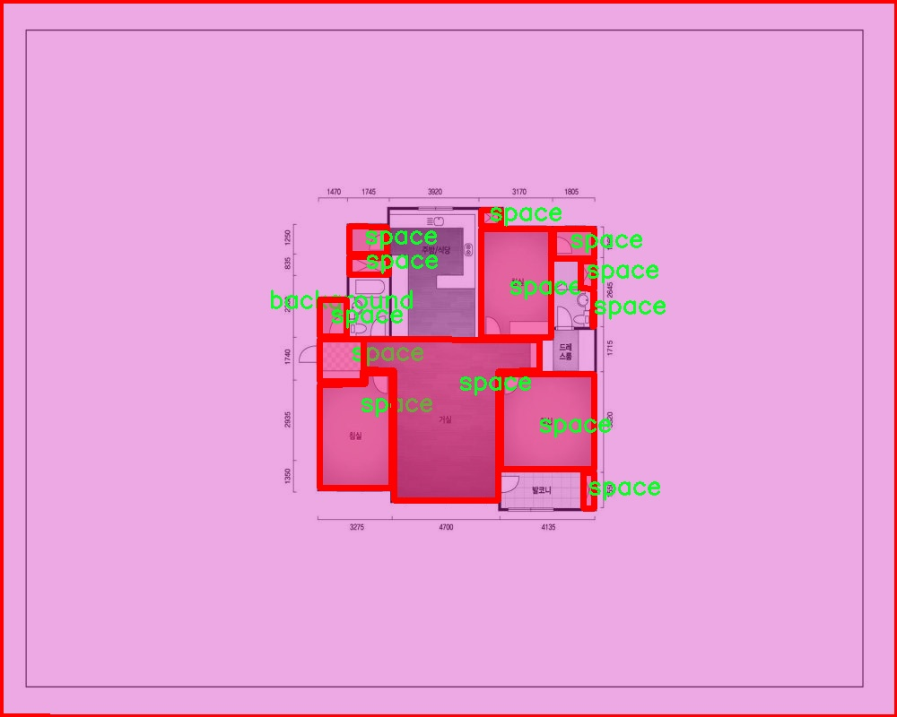
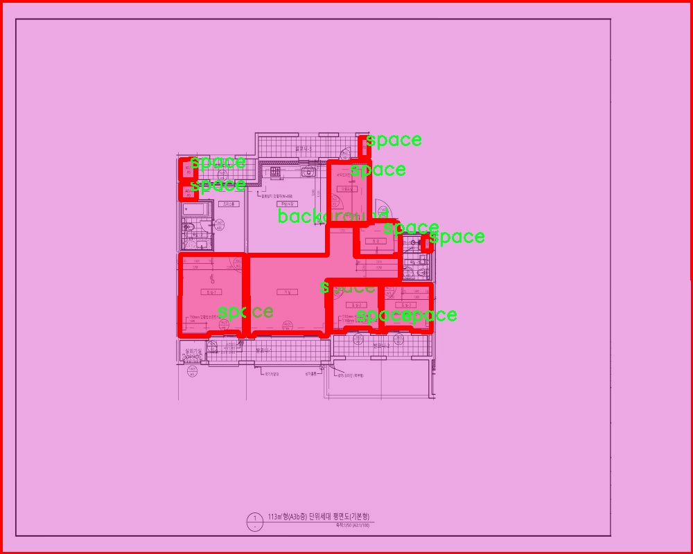

# 建筑图纸室内空间图像分割系统源码＆数据集分享
 [yolov8-seg-C2f-REPVGGOREPA＆yolov8-seg-fasternet等50+全套改进创新点发刊_一键训练教程_Web前端展示]

### 1.研究背景与意义

项目参考[ILSVRC ImageNet Large Scale Visual Recognition Challenge](https://gitee.com/YOLOv8_YOLOv11_Segmentation_Studio/projects)

项目来源[AAAI Global Al lnnovation Contest](https://kdocs.cn/l/cszuIiCKVNis)

研究背景与意义

随着城市化进程的加快，建筑设计与施工的复杂性日益增加，建筑图纸的解读与室内空间的有效利用成为了亟待解决的问题。传统的建筑设计与施工方法往往依赖于人工对图纸的分析与理解，这不仅耗时耗力，而且容易受到人为因素的影响，导致错误和遗漏。因此，如何高效、准确地从建筑图纸中提取出室内空间信息，成为了建筑行业亟需解决的技术难题。

近年来，计算机视觉技术的快速发展为建筑图纸的自动化分析提供了新的可能性。尤其是基于深度学习的图像分割技术，已在多个领域取得了显著的成果。YOLO（You Only Look Once）系列模型以其高效的实时检测能力和优越的准确性，逐渐成为目标检测和图像分割领域的研究热点。YOLOv8作为该系列的最新版本，结合了更为先进的网络结构和训练策略，展现出了更强的性能。然而，针对建筑图纸的特定需求，现有的YOLOv8模型仍需进行改进，以适应建筑室内空间的复杂性和多样性。

本研究旨在基于改进的YOLOv8模型，构建一个高效的建筑图纸室内空间图像分割系统。该系统将利用一个包含1100幅图像的“floor-spac”数据集进行训练和验证。该数据集涵盖了四个主要类别：背景、电梯、空间和楼梯，能够有效反映建筑室内空间的基本构成。通过对这些类别的精确分割，系统将能够自动识别和提取建筑图纸中的关键空间信息，为后续的建筑设计、施工管理和空间利用提供重要支持。

本研究的意义不仅在于技术层面的创新，更在于其对建筑行业的实际应用价值。通过实现建筑图纸的自动化分析，能够显著提高设计与施工的效率，降低人工成本，减少错误率。此外，系统所提取的空间信息还可以为建筑的后续管理与维护提供数据支持，促进建筑生命周期的优化管理。

综上所述，基于改进YOLOv8的建筑图纸室内空间图像分割系统的研究，不仅是对计算机视觉技术在建筑领域应用的探索，更是对提升建筑设计与施工效率、优化空间利用的重要尝试。随着技术的不断进步与应用的深入，未来有望在更广泛的建筑场景中推广和应用，为建筑行业的智能化发展贡献力量。

### 2.图片演示







##### 注意：由于此博客编辑较早，上面“2.图片演示”和“3.视频演示”展示的系统图片或者视频可能为老版本，新版本在老版本的基础上升级如下：（实际效果以升级的新版本为准）

  （1）适配了YOLOV8的“目标检测”模型和“实例分割”模型，通过加载相应的权重（.pt）文件即可自适应加载模型。

  （2）支持“图片识别”、“视频识别”、“摄像头实时识别”三种识别模式。

  （3）支持“图片识别”、“视频识别”、“摄像头实时识别”三种识别结果保存导出，解决手动导出（容易卡顿出现爆内存）存在的问题，识别完自动保存结果并导出到tempDir中。

  （4）支持Web前端系统中的标题、背景图等自定义修改，后面提供修改教程。

  另外本项目提供训练的数据集和训练教程,暂不提供权重文件（best.pt）,需要您按照教程进行训练后实现图片演示和Web前端界面演示的效果。

### 3.视频演示

[3.1 视频演示](https://www.bilibili.com/video/BV1HA2UYFExz/)

### 4.数据集信息展示

##### 4.1 本项目数据集详细数据（类别数＆类别名）

nc: 4
names: ['background', 'elevator', 'space', 'stair']


##### 4.2 本项目数据集信息介绍

数据集信息展示

在现代建筑设计与室内空间管理中，图像分割技术的应用日益广泛，尤其是在自动化识别和分析建筑图纸方面。为此，我们构建了一个名为“floor-spac”的数据集，旨在为改进YOLOv8-seg的建筑图纸室内空间图像分割系统提供强有力的支持。该数据集专注于室内空间的特征提取，包含四个主要类别，分别是背景、电梯、空间和楼梯。这些类别的选择不仅反映了建筑图纸中常见的元素，还为模型的训练提供了多样化的样本，确保了其在实际应用中的有效性和准确性。

“floor-spac”数据集的设计理念是通过高质量的标注图像，帮助深度学习模型更好地理解和分割建筑室内空间的不同区域。数据集中包含的四个类别具有明显的特征和功能，背景类别主要用于提供图像的上下文信息，而电梯、空间和楼梯则是室内设计中不可或缺的组成部分。电梯作为建筑内的垂直交通工具，其位置和设计直接影响到空间的流动性；空间类别则涵盖了房间、走廊等功能性区域，是室内布局的核心；楼梯则是连接不同楼层的重要元素，通常在建筑图纸中占据显著位置。

为了确保数据集的多样性和代表性，我们在不同类型的建筑图纸中收集了大量样本。这些样本不仅包括商业建筑、住宅楼，还涵盖了公共设施等多种场景，力求在各种环境下都能有效地进行图像分割。每个类别的图像都经过精细的标注，确保模型在训练过程中能够准确学习到每个类别的特征。这种精确的标注方式，不仅提升了模型的学习效率，也为后续的验证和测试提供了可靠的基础。

在数据集的构建过程中，我们还特别关注了图像的质量和分辨率，确保所用图像在视觉上清晰且细节丰富。这一方面有助于提高模型对复杂场景的理解能力，另一方面也为后续的应用提供了更为精准的基础。通过对“floor-spac”数据集的深入分析和应用，我们期望能够推动建筑图纸室内空间图像分割技术的发展，进而提升建筑设计和空间管理的智能化水平。

总之，“floor-spac”数据集不仅是改进YOLOv8-seg模型的重要资源，更是推动建筑领域智能化进程的关键一环。通过这一数据集的应用，我们相信能够在建筑图纸的自动化处理和分析中取得显著进展，为相关研究和实际应用提供坚实的基础。随着数据集的不断扩展和优化，我们期待其在更广泛的场景中发挥作用，助力建筑行业的数字化转型。











### 5.全套项目环境部署视频教程（零基础手把手教学）

[5.1 环境部署教程链接（零基础手把手教学）](https://www.bilibili.com/video/BV1jG4Ve4E9t/?vd_source=bc9aec86d164b67a7004b996143742dc)


[5.2 安装Python虚拟环境创建和依赖库安装视频教程链接（零基础手把手教学）](https://www.bilibili.com/video/BV1nA4VeYEze/?vd_source=bc9aec86d164b67a7004b996143742dc)

### 6.手把手YOLOV8-seg训练视频教程（零基础小白有手就能学会）

[6.1 手把手YOLOV8-seg训练视频教程（零基础小白有手就能学会）](https://www.bilibili.com/video/BV1cA4VeYETe/?vd_source=bc9aec86d164b67a7004b996143742dc)


按照上面的训练视频教程链接加载项目提供的数据集，运行train.py即可开始训练



     Epoch   gpu_mem       box       obj       cls    labels  img_size
     1/200     0G   0.01576   0.01955  0.007536        22      1280: 100%|██████████| 849/849 [14:42<00:00,  1.04s/it]
               Class     Images     Labels          P          R     mAP@.5 mAP@.5:.95: 100%|██████████| 213/213 [01:14<00:00,  2.87it/s]
                 all       3395      17314      0.994      0.957      0.0957      0.0843

     Epoch   gpu_mem       box       obj       cls    labels  img_size
     2/200     0G   0.01578   0.01923  0.007006        22      1280: 100%|██████████| 849/849 [14:44<00:00,  1.04s/it]
               Class     Images     Labels          P          R     mAP@.5 mAP@.5:.95: 100%|██████████| 213/213 [01:12<00:00,  2.95it/s]
                 all       3395      17314      0.996      0.956      0.0957      0.0845

     Epoch   gpu_mem       box       obj       cls    labels  img_size
     3/200     0G   0.01561    0.0191  0.006895        27      1280: 100%|██████████| 849/849 [10:56<00:00,  1.29it/s]
               Class     Images     Labels          P          R     mAP@.5 mAP@.5:.95: 100%|███████   | 187/213 [00:52<00:00,  4.04it/s]
                 all       3395      17314      0.996      0.957      0.0957      0.0845


### 7.50+种全套YOLOV8-seg创新点代码加载调参视频教程（一键加载写好的改进模型的配置文件）

[7.1 50+种全套YOLOV8-seg创新点代码加载调参视频教程（一键加载写好的改进模型的配置文件）](https://www.bilibili.com/video/BV1Hw4VePEXv/?vd_source=bc9aec86d164b67a7004b996143742dc)

### 8.YOLOV8-seg图像分割算法原理

原始YOLOv8-seg算法原理

YOLOv8-seg算法是YOLO系列中的最新成员，旨在提升目标检测与分割的性能。与其前身YOLOv5相比，YOLOv8在精度和速度上都有显著的提升，尤其是在处理复杂场景和多样化目标时表现出色。YOLOv8-seg不仅继承了YOLO系列一贯的高效特性，还引入了一系列创新设计，使其在目标检测和分割任务中具备更强的适应性和准确性。

YOLOv8-seg的网络结构由四个主要部分组成：输入端、骨干网络、颈部网络和头部网络。输入端的设计采用了马赛克数据增强、自适应锚框计算和自适应灰度填充等技术，旨在提升模型的鲁棒性和泛化能力。马赛克增强通过将多张图像拼接成一张图像，增加了训练样本的多样性，从而帮助模型更好地学习到不同场景下的特征。自适应锚框计算则通过动态调整锚框的大小和形状，确保模型能够适应不同尺度和形状的目标，提高检测精度。

在骨干网络方面，YOLOv8-seg采用了C2f模块，这一模块的设计灵感来源于YOLOv7的ELAN结构。C2f模块通过引入更多的分支和跨层连接，增强了模型的梯度流，使得特征表示能力显著提升。具体而言，C2f模块由多个卷积块和瓶颈结构组成，这些结构的组合不仅提高了特征提取的效率，还减轻了深层网络中的梯度消失问题。通过这种方式，YOLOv8-seg能够更好地捕捉到图像中的细节信息，从而在目标检测和分割任务中表现出色。

颈部网络则采用了路径聚合网络（PAN）结构，旨在增强不同尺度特征的融合能力。PAN通过自下而上的特征融合，确保了浅层特征与深层特征之间的有效信息传递，从而提升了模型对多尺度目标的检测能力。这一结构的设计理念在于，目标的不同尺度信息需要在特征融合时得到充分利用，以便于模型在处理复杂场景时，能够准确识别和分割出各类目标。

头部网络是YOLOv8-seg的关键部分，其主要功能是将颈部网络输出的特征图转换为最终的检测结果。YOLOv8-seg采用了解耦头结构，将分类和回归任务分开处理，这一设计显著提高了模型的收敛速度和预测精度。分类任务关注的是特征图中目标的类别，而回归任务则专注于目标的边界框位置。通过将这两者解耦，YOLOv8-seg能够更有效地进行特征学习，从而在目标检测和分割中取得更好的效果。

在损失函数的设计上，YOLOv8-seg引入了多种损失计算策略，包括二元交叉熵损失和分布焦点损失。这些损失函数的结合使用，使得模型在训练过程中能够更好地处理正负样本的不平衡问题，尤其是在小目标检测和复杂背景下的目标分割任务中，能够有效提升模型的学习效果。此外，YOLOv8-seg还采用了无锚框检测策略，减少了锚框预测的数量，进而加速了非最大抑制（NMS）过程，提高了模型的推理速度。

值得一提的是，YOLOv8-seg在处理图像时，采用了640x640的输入尺寸，并在数据预处理阶段引入了多种增强手段，如混合增强、空间扰动和颜色扰动等。这些数据增强技术的使用，进一步提升了模型的鲁棒性，使其在面对不同光照、角度和背景变化时，依然能够保持较高的检测精度。

总的来说，YOLOv8-seg算法通过一系列创新的网络结构和优化策略，成功地在目标检测与分割领域实现了性能的提升。其在骨干网络、颈部网络和头部网络的设计上，充分考虑了特征提取、特征融合和特征解耦的需求，使得模型能够更好地适应复杂的应用场景。未来，随着YOLOv8-seg的不断发展和优化，预计将在更多实际应用中展现出其强大的能力，推动目标检测与分割技术的进一步进步。


### 9.系统功能展示（检测对象为举例，实际内容以本项目数据集为准）

图9.1.系统支持检测结果表格显示

  图9.2.系统支持置信度和IOU阈值手动调节

  图9.3.系统支持自定义加载权重文件best.pt(需要你通过步骤5中训练获得)

  图9.4.系统支持摄像头实时识别

  图9.5.系统支持图片识别

  图9.6.系统支持视频识别

  图9.7.系统支持识别结果文件自动保存

  图9.8.系统支持Excel导出检测结果数据


### 10.50+种全套YOLOV8-seg创新点原理讲解（非科班也可以轻松写刊发刊，V11版本正在科研待更新）

#### 10.1 由于篇幅限制，每个创新点的具体原理讲解就不一一展开，具体见下列网址中的创新点对应子项目的技术原理博客网址【Blog】：


[10.1 50+种全套YOLOV8-seg创新点原理讲解链接](https://gitee.com/qunmasj/good)

#### 10.2 部分改进模块原理讲解(完整的改进原理见上图和技术博客链接)【如果此小节的图加载失败可以通过CSDN或者Github搜索该博客的标题访问原始博客，原始博客图片显示正常】

### YOLOv8简介
YoloV8模型结构
YOLOv3之前的所有YOLO对象检测模型都是用C语言编写的，并使用了Darknet框架，Ultralytics发布了第一个使用PyTorch框架实现的YOLO (YOLOv3)；YOLOv3之后，Ultralytics发布了YOLOv5，在2023年1月，Ultralytics发布了YOLOv8，包含五个模型，用于检测、分割和分类。 YOLOv8 Nano是其中最快和最小的，而YOLOv8 Extra Large (YOLOv8x)是其中最准确但最慢的，具体模型见后续的图。

YOLOv8附带以下预训练模型:

目标检测在图像分辨率为640的COCO检测数据集上进行训练。
实例分割在图像分辨率为640的COCO分割数据集上训练。
图像分类模型在ImageNet数据集上预训练，图像分辨率为224。
YOLOv8 概述
具体到 YOLOv8 算法，其核心特性和改动可以归结为如下：

提供了一个全新的SOTA模型（state-of-the-art model），包括 P5 640 和 P6 1280 分辨率的目标检测网络和基于YOLACT的实例分割模型。和 YOLOv5 一样，基于缩放系数也提供了 N/S/M/L/X 尺度的不同大小模型，用于满足不同场景需求
骨干网络和 Neck 部分可能参考了 YOLOv7 ELAN 设计思想，将 YOLOv5 的 C3 结构换成了梯度流更丰富的 C2f 结构，并对不同尺度模型调整了不同的通道数，属于对模型结构精心微调，不再是一套参数应用所有模型，大幅提升了模型性能。
Head 部分相比 YOLOv5 改动较大，换成了目前主流的解耦头结构，将分类和检测头分离，同时也从Anchor-Based 换成了 Anchor-Free
Loss 计算方面采用了TaskAlignedAssigner正样本分配策略，并引入了Distribution Focal Loss
训练的数据增强部分引入了 YOLOX 中的最后 10 epoch 关闭 Mosiac 增强的操作，可以有效地提升精度


### HRNet V2简介
现在设计高低分辨率融合的思路主要有以下四种：


（a）对称结构。如U-Net、Hourglass等，都是先下采样再上采样，上下采样过程对称。

（b）级联金字塔。如refinenet等，高低分辨率融合时经过卷积处理。

（c）简单的baseline，用转职卷积进行上采样。

（d）扩张卷积。如deeplab等，增大感受野，减少下采样次数，可以无需跳层连接直接进行上采样。

（b）（c）都是使用复杂一些的网络进行下采样（如resnet、vgg），再用轻量级的网络进行上采样。

HRNet V1是在（b）的基础上进行改进，从头到尾保持大的分辨率表示。然而HRNet V1仅是用在姿态估计领域的，HRNet V2对它做小小的改进可以使其适用于更广的视觉任务。这一改进仅仅增加了较小的计算开销，但却提升了较大的准确度。

#### 网络结构图：


这个结构图简洁明了就不多介绍了，首先图2的输入是已经经过下采样四倍的feature map，横向的conv block指的是basicblock 或 bottleblock，不同分辨率之间的多交叉线部分是multi-resolution convolution（多分辨率组卷积）。

到此为止HRNet V2和HRNet V1是完全一致的。

区别之处在于这个基网络上加的一个head：


图3介绍的是接在图2最后的head。（a）是HRNet V1的头，很明显他只用了大分辨率的特征图。（b）（c）是HRNet V2的创新点，（b）用与语义分割，（c）用于目标检测。除此之外作者还在实验部分介绍了用于分类的head，如图4所示。


#### 多分辨率block：


一个多分辨率block由多分辨率组卷积（a）和多分辨率卷积（b）组成。（c）是一个正常卷积的展开，（b）的灵感来源于（c）。代码中（a）部分由Bottleneck和BasicBlock组成。

多分辨率卷积和正常卷积的区别：（1）多分辨率卷积中，每个通道的subset的分辨率都不一样。（2）通道之间的连接如果是降分辨率，则用的是3x3的2stride的卷积，如果是升分辨率，用的是双线性最邻近插值上采样。


### 11.项目核心源码讲解（再也不用担心看不懂代码逻辑）

#### 11.1 ultralytics\utils\callbacks\clearml.py

以下是对代码的核心部分进行提炼和详细注释的结果：

```python
# 导入必要的库和模块
from ultralytics.utils import LOGGER, SETTINGS, TESTS_RUNNING

# 尝试导入 ClearML 相关模块，并进行一些基本的检查
try:
    assert not TESTS_RUNNING  # 确保不是在测试环境中
    assert SETTINGS['clearml'] is True  # 确保 ClearML 集成已启用
    import clearml
    from clearml import Task
    from clearml.binding.frameworks.pytorch_bind import PatchPyTorchModelIO
    from clearml.binding.matplotlib_bind import PatchedMatplotlib

    assert hasattr(clearml, '__version__')  # 确保 clearml 不是一个目录

except (ImportError, AssertionError):
    clearml = None  # 如果导入失败，则将 clearml 设置为 None


def _log_debug_samples(files, title='Debug Samples') -> None:
    """
    在 ClearML 任务中记录调试样本（图像）。

    参数:
        files (list): PosixPath 格式的文件路径列表。
        title (str): 将具有相同值的图像分组的标题。
    """
    import re

    task = Task.current_task()  # 获取当前任务
    if task:
        for f in files:
            if f.exists():  # 检查文件是否存在
                it = re.search(r'_batch(\d+)', f.name)  # 提取批次号
                iteration = int(it.groups()[0]) if it else 0  # 获取迭代次数
                task.get_logger().report_image(title=title,
                                               series=f.name.replace(it.group(), ''),
                                               local_path=str(f),
                                               iteration=iteration)  # 记录图像


def on_pretrain_routine_start(trainer):
    """在预训练例程开始时运行；初始化并连接/记录任务到 ClearML。"""
    try:
        task = Task.current_task()  # 获取当前任务
        if task:
            # 确保自动的 PyTorch 和 Matplotlib 绑定被禁用
            PatchPyTorchModelIO.update_current_task(None)
            PatchedMatplotlib.update_current_task(None)
        else:
            # 初始化一个新的 ClearML 任务
            task = Task.init(project_name=trainer.args.project or 'YOLOv8',
                             task_name=trainer.args.name,
                             tags=['YOLOv8'],
                             output_uri=True,
                             reuse_last_task_id=False,
                             auto_connect_frameworks={
                                 'pytorch': False,
                                 'matplotlib': False})
            LOGGER.warning('ClearML Initialized a new task. If you want to run remotely, '
                           'please add clearml-init and connect your arguments before initializing YOLO.')
        task.connect(vars(trainer.args), name='General')  # 连接训练参数
    except Exception as e:
        LOGGER.warning(f'WARNING ⚠️ ClearML installed but not initialized correctly, not logging this run. {e}')


def on_train_epoch_end(trainer):
    """在 YOLO 训练的每个 epoch 结束时记录调试样本并报告当前训练进度。"""
    task = Task.current_task()  # 获取当前任务
    if task:
        # 记录调试样本
        if trainer.epoch == 1:
            _log_debug_samples(sorted(trainer.save_dir.glob('train_batch*.jpg')), 'Mosaic')
        # 报告当前训练进度
        for k, v in trainer.validator.metrics.results_dict.items():
            task.get_logger().report_scalar('train', k, v, iteration=trainer.epoch)


def on_train_end(trainer):
    """在训练完成时记录最终模型及其名称。"""
    task = Task.current_task()  # 获取当前任务
    if task:
        # 记录最终结果，混淆矩阵 + PR 图
        files = [
            'results.png', 'confusion_matrix.png', 'confusion_matrix_normalized.png',
            *(f'{x}_curve.png' for x in ('F1', 'PR', 'P', 'R'))]
        files = [(trainer.save_dir / f) for f in files if (trainer.save_dir / f).exists()]  # 过滤存在的文件
        for f in files:
            _log_plot(title=f.stem, plot_path=f)  # 记录图像
        # 报告最终指标
        for k, v in trainer.validator.metrics.results_dict.items():
            task.get_logger().report_single_value(k, v)
        # 记录最终模型
        task.update_output_model(model_path=str(trainer.best), model_name=trainer.args.name, auto_delete_file=False)


# 定义回调函数字典，如果 clearml 可用则添加相应的回调
callbacks = {
    'on_pretrain_routine_start': on_pretrain_routine_start,
    'on_train_epoch_end': on_train_epoch_end,
    'on_train_end': on_train_end} if clearml else {}
```

### 代码核心部分说明：
1. **ClearML集成**：代码首先尝试导入ClearML库，并进行一些基本的检查，确保环境设置正确。
2. **记录调试样本**：`_log_debug_samples`函数用于在ClearML任务中记录图像文件，便于调试和可视化。
3. **预训练开始时的初始化**：`on_pretrain_routine_start`函数在预训练开始时初始化ClearML任务，并连接训练参数。
4. **训练周期结束时的记录**：`on_train_epoch_end`函数在每个训练周期结束时记录调试样本和训练进度。
5. **训练结束时的记录**：`on_train_end`函数在训练完成时记录最终模型和相关结果，包括混淆矩阵和性能曲线。

这些核心部分为YOLO训练过程中的数据记录和可视化提供了基础功能，确保训练过程中的重要信息能够被有效地记录和分析。

这个文件是Ultralytics YOLO项目中的一个回调模块，主要用于与ClearML进行集成，以便在训练过程中记录和可视化模型的训练状态和结果。文件中首先尝试导入ClearML库，并进行一些基本的检查，以确保ClearML的集成已启用且正确安装。如果导入失败，`clearml`变量将被设置为`None`，后续的回调将不会被注册。

文件定义了一些函数，这些函数在不同的训练阶段被调用，以记录调试样本、绘图和训练进度等信息。首先，`_log_debug_samples`函数用于将图像文件作为调试样本记录到ClearML任务中。它接受一个文件路径列表和一个标题作为参数，遍历文件并将存在的文件记录到当前任务的日志中。

接下来，`_log_plot`函数用于将保存的图像文件作为绘图记录到ClearML的绘图部分。它读取图像并使用Matplotlib进行可视化，然后将图像报告到ClearML中。

`on_pretrain_routine_start`函数在预训练例程开始时运行，负责初始化和连接ClearML任务。如果当前没有任务，它会创建一个新任务，并将训练参数连接到任务中。

`on_train_epoch_end`函数在每个训练周期结束时被调用，记录调试样本并报告当前的训练进度。在第一个周期结束时，它会记录训练样本的图像。

`on_fit_epoch_end`函数在每个周期结束时报告模型信息到日志中，包括当前周期的时间和在第一个周期时的模型信息。

`on_val_end`函数在验证结束时被调用，记录验证结果，包括标签和预测的图像。

最后，`on_train_end`函数在训练完成时被调用，记录最终模型及其名称，并将最终的结果（如混淆矩阵和PR曲线）记录到ClearML中。

文件的最后部分定义了一个回调字典，包含了上述函数，只有在成功导入ClearML的情况下，这些回调才会被注册。这样，整个模块的设计旨在无缝集成ClearML，以便在YOLO模型训练过程中进行有效的监控和记录。

#### 11.2 ui.py

以下是代码中最核心的部分，并附上详细的中文注释：

```python
import sys
import subprocess

def run_script(script_path):
    """
    使用当前 Python 环境运行指定的脚本。

    Args:
        script_path (str): 要运行的脚本路径

    Returns:
        None
    """
    # 获取当前 Python 解释器的路径
    python_path = sys.executable

    # 构建运行命令，使用 streamlit 运行指定的脚本
    command = f'"{python_path}" -m streamlit run "{script_path}"'

    # 执行命令
    result = subprocess.run(command, shell=True)
    # 检查命令执行的返回码，如果不为0，表示出错
    if result.returncode != 0:
        print("脚本运行出错。")


# 实例化并运行应用
if __name__ == "__main__":
    # 指定要运行的脚本路径
    script_path = "web.py"  # 这里可以替换为实际的脚本路径

    # 调用函数运行脚本
    run_script(script_path)
```

### 代码说明：
1. **导入模块**：
   - `sys`：用于访问与 Python 解释器紧密相关的变量和函数。
   - `subprocess`：用于创建新进程、连接到它们的输入/输出/错误管道，并获得返回码。

2. **定义 `run_script` 函数**：
   - 该函数接收一个脚本路径作为参数，并使用当前 Python 环境运行该脚本。
   - 使用 `sys.executable` 获取当前 Python 解释器的路径。
   - 构建一个命令字符串，使用 `streamlit` 模块运行指定的脚本。
   - 使用 `subprocess.run` 执行命令，并检查返回码以判断脚本是否成功运行。

3. **主程序入口**：
   - 当脚本作为主程序运行时，指定要运行的脚本路径（这里是 `web.py`）。
   - 调用 `run_script` 函数来执行该脚本。

这个程序文件名为 `ui.py`，主要功能是通过当前的 Python 环境来运行一个指定的脚本，具体是使用 Streamlit 框架来启动一个 Web 应用。

首先，程序导入了几个必要的模块，包括 `sys`、`os` 和 `subprocess`。其中，`sys` 模块用于访问与 Python 解释器相关的变量和函数，`os` 模块提供了与操作系统交互的功能，而 `subprocess` 模块则用于创建新进程、连接到它们的输入/输出/错误管道，并获取它们的返回码。

接下来，程序从 `QtFusion.path` 模块中导入了 `abs_path` 函数，这个函数的作用是获取文件的绝对路径。

在 `run_script` 函数中，程序接收一个参数 `script_path`，表示要运行的脚本的路径。函数内部首先获取当前 Python 解释器的路径，接着构建一个命令字符串，该命令使用 Streamlit 框架来运行指定的脚本。具体来说，命令的格式是 `"{python_path}" -m streamlit run "{script_path}"`，其中 `python_path` 是当前 Python 解释器的路径，`script_path` 是要运行的脚本的路径。

然后，程序使用 `subprocess.run` 方法来执行这个命令。`shell=True` 参数允许在 shell 中执行命令。执行完命令后，程序检查返回码，如果返回码不为 0，表示脚本运行出错，程序会打印出相应的错误信息。

最后，在文件的主程序部分，使用 `if __name__ == "__main__":` 来确保只有在直接运行该文件时才会执行以下代码。这里指定了要运行的脚本路径 `script_path`，调用 `abs_path` 函数获取 `web.py` 的绝对路径，并最终调用 `run_script` 函数来运行这个脚本。

总的来说，这个程序的主要目的是为了方便地启动一个 Streamlit Web 应用，确保用户可以在当前的 Python 环境中运行指定的脚本。

#### 11.3 ultralytics\trackers\basetrack.py

以下是经过简化并添加详细中文注释的核心代码部分：

```python
# Ultralytics YOLO 🚀, AGPL-3.0 license

from collections import OrderedDict
import numpy as np

class TrackState:
    """对象跟踪状态的枚举类。"""
    New = 0      # 新建状态
    Tracked = 1  # 被跟踪状态
    Lost = 2     # 丢失状态
    Removed = 3  # 被移除状态

class BaseTrack:
    """对象跟踪的基类，处理基本的跟踪属性和操作。"""

    _count = 0  # 全局跟踪ID计数器

    def __init__(self):
        self.track_id = BaseTrack.next_id()  # 分配唯一的跟踪ID
        self.is_activated = False  # 跟踪是否被激活
        self.state = TrackState.New  # 初始状态为新建
        self.history = OrderedDict()  # 存储历史数据的有序字典
        self.features = []  # 特征列表
        self.curr_feature = None  # 当前特征
        self.score = 0  # 跟踪分数
        self.start_frame = 0  # 开始帧
        self.frame_id = 0  # 当前帧ID
        self.time_since_update = 0  # 自上次更新以来的时间

        # 多摄像头支持
        self.location = (np.inf, np.inf)  # 初始位置设为无穷大

    @property
    def end_frame(self):
        """返回跟踪的最后帧ID。"""
        return self.frame_id

    @staticmethod
    def next_id():
        """递增并返回全局跟踪ID计数器。"""
        BaseTrack._count += 1
        return BaseTrack._count

    def mark_lost(self):
        """将跟踪标记为丢失。"""
        self.state = TrackState.Lost

    def mark_removed(self):
        """将跟踪标记为移除。"""
        self.state = TrackState.Removed

    @staticmethod
    def reset_id():
        """重置全局跟踪ID计数器。"""
        BaseTrack._count = 0
```

### 代码说明：
1. **TrackState 类**：定义了对象跟踪的不同状态，包括新建、被跟踪、丢失和被移除。
2. **BaseTrack 类**：这是一个基类，用于管理对象的跟踪。它包含跟踪的基本属性和方法。
   - `__init__` 方法：初始化跟踪对象的属性，包括唯一的跟踪ID、状态、历史记录、特征等。
   - `end_frame` 属性：返回跟踪的最后帧ID。
   - `next_id` 静态方法：用于生成唯一的跟踪ID。
   - `mark_lost` 和 `mark_removed` 方法：用于更新跟踪状态为丢失或移除。
   - `reset_id` 静态方法：重置全局跟踪ID计数器。

这个程序文件定义了一个用于对象跟踪的基础类`BaseTrack`，以及一个用于表示跟踪状态的枚举类`TrackState`。首先，`TrackState`类定义了四种可能的跟踪状态：新建（New）、跟踪中（Tracked）、丢失（Lost）和已移除（Removed），这些状态可以帮助管理和更新跟踪对象的状态。

接下来，`BaseTrack`类是一个对象跟踪的基类，负责处理基本的跟踪属性和操作。类中定义了一些静态和实例属性，包括跟踪ID、激活状态、当前状态、历史记录、特征、得分、起始帧、当前帧ID、更新间隔时间以及多摄像头位置等。`_count`是一个静态变量，用于生成唯一的跟踪ID。

`BaseTrack`类中还定义了一些方法。`end_frame`属性返回跟踪的最后一帧ID。`next_id`静态方法用于递增并返回全局跟踪ID计数器。`activate`、`predict`和`update`方法是抽象方法，需在子类中实现，分别用于激活跟踪、预测下一个状态和更新跟踪信息。`mark_lost`和`mark_removed`方法用于将跟踪状态标记为丢失或已移除。最后，`reset_id`静态方法用于重置全局跟踪ID计数器。

整体来看，这个文件为对象跟踪提供了一个基础框架，后续可以通过继承`BaseTrack`类来实现具体的跟踪算法和逻辑。

#### 11.4 ultralytics\nn\backbone\EfficientFormerV2.py

以下是经过简化和注释的核心代码部分，主要保留了EfficientFormerV2模型的结构和功能：

```python
import torch
import torch.nn as nn
import math
from typing import List

class Attention4D(nn.Module):
    """4D注意力机制模块"""
    def __init__(self, dim: int, key_dim: int, num_heads: int, resolution: int):
        super().__init__()
        self.num_heads = num_heads
        self.scale = key_dim ** -0.5  # 缩放因子
        self.resolution = resolution

        # 定义查询、键、值的卷积层
        self.q = nn.Conv2d(dim, num_heads * key_dim, kernel_size=1)
        self.k = nn.Conv2d(dim, num_heads * key_dim, kernel_size=1)
        self.v = nn.Conv2d(dim, num_heads * key_dim * 4, kernel_size=1)  # 值的维度为4倍

        # 注意力偏置参数
        self.attention_biases = nn.Parameter(torch.zeros(num_heads, resolution ** 2))

    def forward(self, x: torch.Tensor) -> torch.Tensor:
        """前向传播"""
        B, C, H, W = x.shape
        q = self.q(x).view(B, self.num_heads, -1, self.resolution ** 2).permute(0, 1, 3, 2)  # 查询
        k = self.k(x).view(B, self.num_heads, -1, self.resolution ** 2).permute(0, 1, 2, 3)  # 键
        v = self.v(x).view(B, self.num_heads, -1, self.resolution ** 2).permute(0, 1, 3, 2)  # 值

        # 计算注意力权重
        attn = (q @ k) * self.scale + self.attention_biases[:, :H * W]
        attn = attn.softmax(dim=-1)  # 归一化

        # 应用注意力权重
        x = (attn @ v).permute(0, 1, 3, 2).reshape(B, -1, H, W)  # 输出
        return x

class Mlp(nn.Module):
    """多层感知机模块"""
    def __init__(self, in_features: int, hidden_features: int, out_features: int):
        super().__init__()
        self.fc1 = nn.Conv2d(in_features, hidden_features, kernel_size=1)  # 第一层
        self.fc2 = nn.Conv2d(hidden_features, out_features, kernel_size=1)  # 第二层

    def forward(self, x: torch.Tensor) -> torch.Tensor:
        """前向传播"""
        x = self.fc1(x)
        x = nn.GELU()(x)  # 激活函数
        x = self.fc2(x)
        return x

class EfficientFormerV2(nn.Module):
    """EfficientFormerV2模型"""
    def __init__(self, layers: List[int], embed_dims: List[int]):
        super().__init__()
        self.layers = layers
        self.embed_dims = embed_dims

        # 构建网络
        self.network = nn.ModuleList()
        for i in range(len(layers)):
            self.network.append(Attention4D(embed_dims[i], key_dim=32, num_heads=8, resolution=7))
            self.network.append(Mlp(embed_dims[i], hidden_features=embed_dims[i] * 4, out_features=embed_dims[i]))

    def forward(self, x: torch.Tensor) -> List[torch.Tensor]:
        """前向传播"""
        outs = []
        for block in self.network:
            x = block(x)
            outs.append(x)  # 收集输出
        return outs

# 示例用法
if __name__ == '__main__':
    inputs = torch.randn((1, 3, 640, 640))  # 输入数据
    model = EfficientFormerV2(layers=[2, 2, 2], embed_dims=[32, 64, 128])  # 初始化模型
    res = model(inputs)  # 前向传播
    for i in res:
        print(i.size())  # 输出每层的尺寸
```

### 代码注释说明：
1. **Attention4D**: 实现了一个4D注意力机制，包含查询、键、值的卷积层，计算注意力权重并应用于输入。
2. **Mlp**: 实现了一个简单的多层感知机，包含两层1x1卷积和激活函数。
3. **EfficientFormerV2**: 构建了EfficientFormerV2模型，包含多个注意力和MLP模块的组合。
4. **示例用法**: 在主程序中创建输入数据，初始化模型并进行前向传播，最后输出每层的尺寸。

这个程序文件实现了一个名为 `EfficientFormerV2` 的深度学习模型，主要用于图像处理任务。代码首先导入了一些必要的库，包括 PyTorch 和一些数学函数。接着定义了一些与模型结构相关的常量，如不同模型尺寸的宽度和深度。

模型的核心部分是几个类和函数的定义。首先是 `Attention4D` 类，它实现了一个四维注意力机制，允许模型在空间维度上进行自适应的特征聚合。这个类的构造函数中定义了多个卷积层和批归一化层，用于处理输入特征图。`forward` 方法则实现了注意力机制的计算，包括查询、键、值的生成和注意力权重的计算。

接下来是 `Embedding` 类，它负责将输入图像转换为嵌入特征。根据不同的模式（轻量级或使用注意力机制），它会使用不同的卷积层和归一化层来生成嵌入。

`Mlp` 类实现了一个多层感知机（MLP），使用1x1卷积来进行特征转换。`AttnFFN` 和 `FFN` 类则结合了注意力机制和前馈网络，用于进一步处理特征。

`eformer_block` 函数用于构建模型的基本模块，结合了注意力机制和前馈网络，形成一个完整的块。`EfficientFormerV2` 类则是整个模型的定义，包含了多个层次的网络结构和下采样机制。

在模型的初始化中，构造了一个网络，由多个 `eformer_block` 组成，并根据需要添加归一化层。`forward` 方法则定义了模型的前向传播过程，处理输入并返回特征输出。

最后，文件中还定义了一些辅助函数，如 `update_weight` 用于更新模型权重，以及不同尺寸的模型构造函数（如 `efficientformerv2_s0`、`efficientformerv2_s1` 等），这些函数可以根据指定的参数构建不同配置的模型。

在 `__main__` 部分，代码演示了如何创建不同尺寸的模型实例，并对随机生成的输入进行前向传播，输出每个模型的特征图尺寸。这部分代码用于测试和验证模型的功能。

#### 11.5 ultralytics\nn\modules\conv.py

以下是经过简化和注释的核心代码部分，主要保留了卷积模块的实现及其相关功能：

```python
import torch
import torch.nn as nn
import math

def autopad(k, p=None, d=1):
    """自动计算填充以保持输出形状与输入相同。"""
    if d > 1:
        k = d * (k - 1) + 1 if isinstance(k, int) else [d * (x - 1) + 1 for x in k]  # 实际的卷积核大小
    if p is None:
        p = k // 2 if isinstance(k, int) else [x // 2 for x in k]  # 自动填充
    return p

class Conv(nn.Module):
    """标准卷积层，包含卷积、批归一化和激活函数。"""
    default_act = nn.SiLU()  # 默认激活函数

    def __init__(self, c1, c2, k=1, s=1, p=None, g=1, d=1, act=True):
        """初始化卷积层，参数包括输入通道数、输出通道数、卷积核大小、步幅、填充、分组、扩张和激活函数。"""
        super().__init__()
        self.conv = nn.Conv2d(c1, c2, k, s, autopad(k, p, d), groups=g, dilation=d, bias=False)  # 卷积层
        self.bn = nn.BatchNorm2d(c2)  # 批归一化层
        self.act = self.default_act if act is True else act if isinstance(act, nn.Module) else nn.Identity()  # 激活函数

    def forward(self, x):
        """前向传播，依次应用卷积、批归一化和激活函数。"""
        return self.act(self.bn(self.conv(x)))

class DWConv(Conv):
    """深度卷积层，针对每个输入通道独立进行卷积。"""

    def __init__(self, c1, c2, k=1, s=1, d=1, act=True):
        """初始化深度卷积层，参数包括输入通道数、输出通道数、卷积核大小、步幅、扩张和激活函数。"""
        super().__init__(c1, c2, k, s, g=math.gcd(c1, c2), d=d, act=act)  # 分组卷积

class ConvTranspose(nn.Module):
    """转置卷积层。"""
    default_act = nn.SiLU()  # 默认激活函数

    def __init__(self, c1, c2, k=2, s=2, p=0, bn=True, act=True):
        """初始化转置卷积层，参数包括输入通道数、输出通道数、卷积核大小、步幅、填充、是否使用批归一化和激活函数。"""
        super().__init__()
        self.conv_transpose = nn.ConvTranspose2d(c1, c2, k, s, p, bias=not bn)  # 转置卷积层
        self.bn = nn.BatchNorm2d(c2) if bn else nn.Identity()  # 批归一化层
        self.act = self.default_act if act is True else act if isinstance(act, nn.Module) else nn.Identity()  # 激活函数

    def forward(self, x):
        """前向传播，依次应用转置卷积、批归一化和激活函数。"""
        return self.act(self.bn(self.conv_transpose(x)))

class ChannelAttention(nn.Module):
    """通道注意力模块。"""

    def __init__(self, channels: int) -> None:
        """初始化通道注意力模块，参数为通道数。"""
        super().__init__()
        self.pool = nn.AdaptiveAvgPool2d(1)  # 自适应平均池化
        self.fc = nn.Conv2d(channels, channels, 1, 1, 0, bias=True)  # 1x1卷积
        self.act = nn.Sigmoid()  # Sigmoid激活函数

    def forward(self, x: torch.Tensor) -> torch.Tensor:
        """前向传播，计算通道注意力并应用于输入。"""
        return x * self.act(self.fc(self.pool(x)))  # 通过池化和卷积计算注意力

class CBAM(nn.Module):
    """卷积块注意力模块。"""

    def __init__(self, c1, kernel_size=7):
        """初始化CBAM模块，参数包括输入通道数和卷积核大小。"""
        super().__init__()
        self.channel_attention = ChannelAttention(c1)  # 通道注意力
        self.spatial_attention = SpatialAttention(kernel_size)  # 空间注意力

    def forward(self, x):
        """前向传播，依次应用通道注意力和空间注意力。"""
        return self.spatial_attention(self.channel_attention(x))  # 先计算通道注意力，再计算空间注意力
```

### 代码说明：
1. **autopad**：自动计算填充，以确保卷积输出的形状与输入相同。
2. **Conv**：标准卷积层，包含卷积、批归一化和激活函数。
3. **DWConv**：深度卷积层，每个输入通道独立进行卷积，适用于通道数较多的情况。
4. **ConvTranspose**：转置卷积层，用于上采样。
5. **ChannelAttention**：通道注意力模块，通过自适应池化和1x1卷积计算通道权重。
6. **CBAM**：卷积块注意力模块，结合通道注意力和空间注意力，增强特征表示能力。

这些模块在深度学习模型中常用于特征提取和增强，特别是在目标检测和图像分割任务中。

这个程序文件是一个实现了多种卷积模块的Python代码，主要用于深度学习中的卷积神经网络（CNN），特别是在目标检测和图像处理任务中。代码中定义了多个类，每个类实现了不同类型的卷积操作和功能。

首先，文件导入了必要的库，包括`math`、`numpy`和`torch`，以及`torch.nn`模块，这些都是构建神经网络所需的基础组件。`__all__`变量定义了可以被外部调用的模块和类。

接下来，定义了一个辅助函数`autopad`，用于根据卷积核的大小、填充和扩张参数自动计算填充量，以确保输出的形状与输入的形状相同。

`Conv`类是标准卷积层的实现，包含卷积操作、批归一化和激活函数。它的构造函数接受多个参数，包括输入通道数、输出通道数、卷积核大小、步幅、填充、分组和扩张等。`forward`方法实现了卷积、批归一化和激活的前向传播。

`Conv2`类是对`Conv`类的简化，增加了一个1x1的卷积层，用于在前向传播中将两个卷积的输出相加，从而提高网络的表达能力。

`LightConv`类实现了一种轻量级卷积结构，包含两个卷积层，其中一个是深度卷积（`DWConv`），用于减少参数量和计算量。

`DWConv`类实现了深度卷积，使用了分组卷积的思想，使得每个输入通道只与对应的输出通道进行卷积，进一步减少了计算量。

`DWConvTranspose2d`类实现了深度卷积的转置操作，适用于上采样任务。

`ConvTranspose`类实现了转置卷积层，通常用于生成网络或上采样操作，支持批归一化和激活函数。

`Focus`类用于将空间信息聚焦到通道维度，通过对输入张量进行特定的切片和拼接，增加了网络对空间信息的利用。

`GhostConv`类实现了Ghost卷积，这是一种通过生成额外的特征图来提高网络效率的卷积结构。

`RepConv`类实现了一种可重参数化卷积模块，允许在训练和推理阶段使用不同的结构，从而提高模型的灵活性和性能。

接下来，定义了注意力机制的模块，包括`ChannelAttention`和`SpatialAttention`，分别用于通道注意力和空间注意力的计算，帮助网络更好地关注重要特征。

`CBAM`类结合了通道注意力和空间注意力，形成了一个完整的卷积块注意力模块，增强了特征的表达能力。

最后，`Concat`类用于在指定维度上连接多个张量，通常用于在网络中合并不同层的特征图。

整体来看，这个文件实现了多种卷积操作和注意力机制，为构建高效的卷积神经网络提供了基础组件，适用于各种计算机视觉任务。

#### 11.6 train.py

以下是代码中最核心的部分，并附上详细的中文注释：

```python
import os
import torch
import yaml
from ultralytics import YOLO  # 导入YOLO模型

if __name__ == '__main__':  # 确保该模块被直接运行时才执行以下代码
    # 设置训练参数
    workers = 1  # 数据加载的工作进程数
    batch = 8  # 每个批次的大小，需根据显存和内存进行调整
    device = "0" if torch.cuda.is_available() else "cpu"  # 检查是否有可用的GPU

    # 获取数据集配置文件的绝对路径
    data_path = abs_path(f'datasets/data/data.yaml', path_type='current')

    # 读取YAML文件，保持原有顺序
    with open(data_path, 'r') as file:
        data = yaml.load(file, Loader=yaml.FullLoader)

    # 修改数据集路径
    if 'train' in data and 'val' in data and 'test' in data:
        directory_path = os.path.dirname(data_path)  # 获取数据集目录路径
        data['train'] = os.path.join(directory_path, 'train')  # 更新训练集路径
        data['val'] = os.path.join(directory_path, 'val')  # 更新验证集路径
        data['test'] = os.path.join(directory_path, 'test')  # 更新测试集路径

        # 将修改后的数据写回YAML文件
        with open(data_path, 'w') as file:
            yaml.safe_dump(data, file, sort_keys=False)

    # 加载YOLO模型
    model = YOLO(r"C:\codeseg\codenew\50+种YOLOv8算法改进源码大全和调试加载训练教程（非必要）\改进YOLOv8模型配置文件\yolov8-seg-C2f-Faster.yaml").load("./weights/yolov8s-seg.pt")

    # 开始训练模型
    results = model.train(
        data=data_path,  # 指定训练数据的配置文件路径
        device=device,  # 使用的设备（GPU或CPU）
        workers=workers,  # 数据加载的工作进程数
        imgsz=640,  # 输入图像的大小
        epochs=100,  # 训练的轮数
        batch=batch,  # 每个批次的大小
    )
```

### 代码注释说明：
1. **导入必要的库**：导入`os`、`torch`、`yaml`和YOLO模型相关的库。
2. **设置训练参数**：定义数据加载的工作进程数、批次大小和设备类型（GPU或CPU）。
3. **获取数据集配置文件路径**：使用`abs_path`函数获取数据集的YAML配置文件的绝对路径。
4. **读取和修改YAML文件**：读取YAML文件，更新训练、验证和测试集的路径，并将修改后的内容写回文件。
5. **加载YOLO模型**：根据指定的配置文件和权重文件加载YOLO模型。
6. **训练模型**：调用`model.train`方法开始训练，传入数据路径、设备、工作进程数、图像大小、训练轮数和批次大小等参数。

该程序文件`train.py`主要用于训练YOLO（You Only Look Once）模型，具体是YOLOv8版本的一个变体。程序首先导入了必要的库，包括操作系统库`os`、深度学习框架`torch`、YAML处理库`yaml`、YOLO模型库`ultralytics`以及用于图形界面的`matplotlib`。

在程序的主入口部分，首先设置了一些训练参数。`workers`设置为1，表示使用一个工作进程来加载数据；`batch`设置为8，表示每个批次的样本数量。`device`根据是否有可用的GPU进行选择，如果有则使用GPU（设备编号为0），否则使用CPU。

接下来，程序通过`abs_path`函数获取数据集配置文件`data.yaml`的绝对路径，并将路径中的分隔符统一为Unix风格的斜杠。然后，程序提取出该路径的目录部分，以便后续构建训练、验证和测试数据集的路径。

程序读取YAML文件内容，并检查其中是否包含`train`、`val`和`test`三个字段。如果存在，这些字段的值将被修改为对应的训练、验证和测试数据集的绝对路径。修改完成后，程序将更新后的数据写回到原YAML文件中。

接下来，程序加载YOLO模型的配置文件和预训练权重。这里的模型配置文件是`yolov8-seg-C2f-Faster.yaml`，权重文件是`yolov8s-seg.pt`。程序注释中提到，如果遇到模型大小或设备要求过高的情况，可以尝试其他模型配置文件。

最后，程序调用`model.train()`方法开始训练模型，传入训练数据的配置文件路径、设备、工作进程数量、输入图像大小（640x640）、训练的epoch数量（100）以及批次大小（8）等参数。训练过程将在控制台输出相关信息，帮助用户了解训练进度和效果。

### 12.系统整体结构（节选）

### 整体功能和构架概括

该项目是一个基于YOLO（You Only Look Once）模型的计算机视觉框架，主要用于目标检测和图像处理任务。项目的架构包括多个模块，每个模块负责特定的功能，从模型的定义、训练、回调、数据处理到跟踪等。以下是项目的主要功能模块：

1. **模型定义**：包括YOLO模型和其他神经网络架构（如EfficientFormerV2），负责构建和定义网络结构。
2. **训练与验证**：通过`train.py`文件实现模型的训练过程，支持多种配置和参数设置。
3. **回调机制**：通过回调模块（如`clearml.py`和`wb.py`）实现训练过程中的监控和记录，便于后续分析和可视化。
4. **数据处理**：包括数据增强、数据加载和处理模块，确保输入数据的质量和多样性。
5. **跟踪模块**：实现对象跟踪的基础功能，支持在视频流中对目标进行跟踪。
6. **用户界面**：通过`ui.py`提供一个简单的用户界面，方便用户启动和管理训练过程。

### 文件功能整理表

| 文件路径                                           | 功能描述                                                                                   |
|---------------------------------------------------|------------------------------------------------------------------------------------------|
| `ultralytics/utils/callbacks/clearml.py`         | 集成ClearML进行训练过程的监控和记录，支持调试样本和绘图的记录。                                     |
| `ui.py`                                          | 提供一个用户界面，通过Streamlit启动指定的脚本，方便用户进行操作。                                 |
| `ultralytics/trackers/basetrack.py`              | 定义对象跟踪的基础类和状态管理，提供对象跟踪的基本框架。                                         |
| `ultralytics/nn/backbone/EfficientFormerV2.py`   | 实现EfficientFormerV2模型结构，包含注意力机制和多层网络组件。                                   |
| `ultralytics/nn/modules/conv.py`                 | 实现多种卷积模块，包括标准卷积、深度卷积、转置卷积等，为神经网络提供基础组件。                       |
| `train.py`                                       | 负责训练YOLO模型，加载数据集配置，设置训练参数并启动训练过程。                                   |
| `ultralytics/trackers/utils/kalman_filter.py`    | 实现卡尔曼滤波器，用于跟踪算法中的状态估计和预测。                                             |
| `ultralytics/models/yolo/model.py`               | 定义YOLO模型的结构和前向传播逻辑，负责目标检测的核心功能。                                        |
| `ultralytics/nn/modules/__init__.py`             | 初始化模块，可能包含其他模块的导入和初始化设置。                                               |
| `ultralytics/models/fastsam/val.py`              | 实现FastSAM模型的验证过程，负责评估模型性能。                                                |
| `ultralytics/data/augment.py`                    | 实现数据增强功能，提升训练数据的多样性和鲁棒性。                                               |
| `ultralytics/nn/extra_modules/ops_dcnv3/setup.py`| 设置和配置DCNv3（Deformable Convolutional Networks）模块，提供额外的卷积操作。                  |
| `ultralytics/utils/callbacks/wb.py`              | 集成Weights & Biases进行训练过程的监控和记录，支持实验跟踪和可视化。                             |

这个表格概述了每个文件的主要功能，帮助理解项目的整体架构和各个模块之间的关系。

注意：由于此博客编辑较早，上面“11.项目核心源码讲解（再也不用担心看不懂代码逻辑）”中部分代码可能会优化升级，仅供参考学习，完整“训练源码”、“Web前端界面”和“50+种创新点源码”以“14.完整训练+Web前端界面+50+种创新点源码、数据集获取”的内容为准。

### 13.图片、视频、摄像头图像分割Demo(去除WebUI)代码

在这个博客小节中，我们将讨论如何在不使用WebUI的情况下，实现图像分割模型的使用。本项目代码已经优化整合，方便用户将分割功能嵌入自己的项目中。
核心功能包括图片、视频、摄像头图像的分割，ROI区域的轮廓提取、类别分类、周长计算、面积计算、圆度计算以及颜色提取等。
这些功能提供了良好的二次开发基础。

### 核心代码解读

以下是主要代码片段，我们会为每一块代码进行详细的批注解释：

```python
import random
import cv2
import numpy as np
from PIL import ImageFont, ImageDraw, Image
from hashlib import md5
from model import Web_Detector
from chinese_name_list import Label_list

# 根据名称生成颜色
def generate_color_based_on_name(name):
    ......

# 计算多边形面积
def calculate_polygon_area(points):
    return cv2.contourArea(points.astype(np.float32))

...
# 绘制中文标签
def draw_with_chinese(image, text, position, font_size=20, color=(255, 0, 0)):
    image_pil = Image.fromarray(cv2.cvtColor(image, cv2.COLOR_BGR2RGB))
    draw = ImageDraw.Draw(image_pil)
    font = ImageFont.truetype("simsun.ttc", font_size, encoding="unic")
    draw.text(position, text, font=font, fill=color)
    return cv2.cvtColor(np.array(image_pil), cv2.COLOR_RGB2BGR)

# 动态调整参数
def adjust_parameter(image_size, base_size=1000):
    max_size = max(image_size)
    return max_size / base_size

# 绘制检测结果
def draw_detections(image, info, alpha=0.2):
    name, bbox, conf, cls_id, mask = info['class_name'], info['bbox'], info['score'], info['class_id'], info['mask']
    adjust_param = adjust_parameter(image.shape[:2])
    spacing = int(20 * adjust_param)

    if mask is None:
        x1, y1, x2, y2 = bbox
        aim_frame_area = (x2 - x1) * (y2 - y1)
        cv2.rectangle(image, (x1, y1), (x2, y2), color=(0, 0, 255), thickness=int(3 * adjust_param))
        image = draw_with_chinese(image, name, (x1, y1 - int(30 * adjust_param)), font_size=int(35 * adjust_param))
        y_offset = int(50 * adjust_param)  # 类别名称上方绘制，其下方留出空间
    else:
        mask_points = np.concatenate(mask)
        aim_frame_area = calculate_polygon_area(mask_points)
        mask_color = generate_color_based_on_name(name)
        try:
            overlay = image.copy()
            cv2.fillPoly(overlay, [mask_points.astype(np.int32)], mask_color)
            image = cv2.addWeighted(overlay, 0.3, image, 0.7, 0)
            cv2.drawContours(image, [mask_points.astype(np.int32)], -1, (0, 0, 255), thickness=int(8 * adjust_param))

            # 计算面积、周长、圆度
            area = cv2.contourArea(mask_points.astype(np.int32))
            perimeter = cv2.arcLength(mask_points.astype(np.int32), True)
            ......

            # 计算色彩
            mask = np.zeros(image.shape[:2], dtype=np.uint8)
            cv2.drawContours(mask, [mask_points.astype(np.int32)], -1, 255, -1)
            color_points = cv2.findNonZero(mask)
            ......

            # 绘制类别名称
            x, y = np.min(mask_points, axis=0).astype(int)
            image = draw_with_chinese(image, name, (x, y - int(30 * adjust_param)), font_size=int(35 * adjust_param))
            y_offset = int(50 * adjust_param)

            # 绘制面积、周长、圆度和色彩值
            metrics = [("Area", area), ("Perimeter", perimeter), ("Circularity", circularity), ("Color", color_str)]
            for idx, (metric_name, metric_value) in enumerate(metrics):
                ......

    return image, aim_frame_area

# 处理每帧图像
def process_frame(model, image):
    pre_img = model.preprocess(image)
    pred = model.predict(pre_img)
    det = pred[0] if det is not None and len(det)
    if det:
        det_info = model.postprocess(pred)
        for info in det_info:
            image, _ = draw_detections(image, info)
    return image

if __name__ == "__main__":
    cls_name = Label_list
    model = Web_Detector()
    model.load_model("./weights/yolov8s-seg.pt")

    # 摄像头实时处理
    cap = cv2.VideoCapture(0)
    while cap.isOpened():
        ret, frame = cap.read()
        if not ret:
            break
        ......

    # 图片处理
    image_path = './icon/OIP.jpg'
    image = cv2.imread(image_path)
    if image is not None:
        processed_image = process_frame(model, image)
        ......

    # 视频处理
    video_path = ''  # 输入视频的路径
    cap = cv2.VideoCapture(video_path)
    while cap.isOpened():
        ret, frame = cap.read()
        ......
```


### 14.完整训练+Web前端界面+50+种创新点源码、数据集获取


# [下载链接：https://mbd.pub/o/bread/ZpyZl5xw](https://mbd.pub/o/bread/ZpyZl5xw)